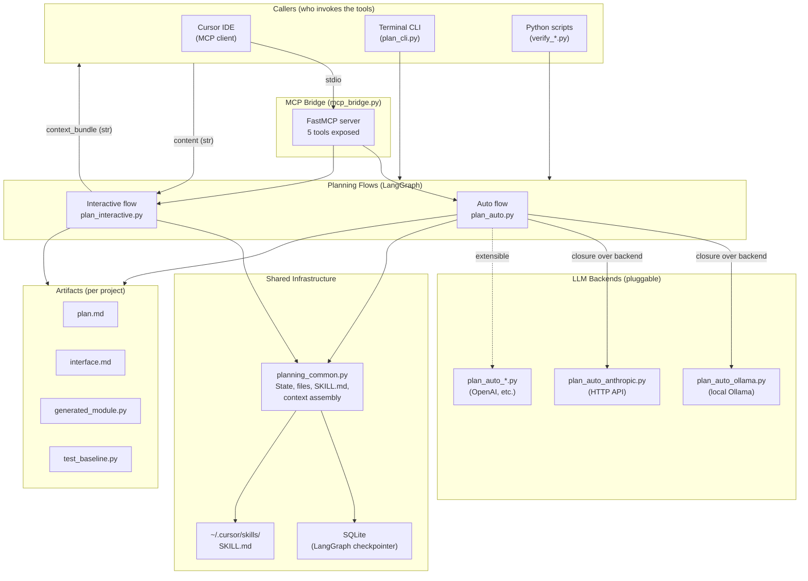
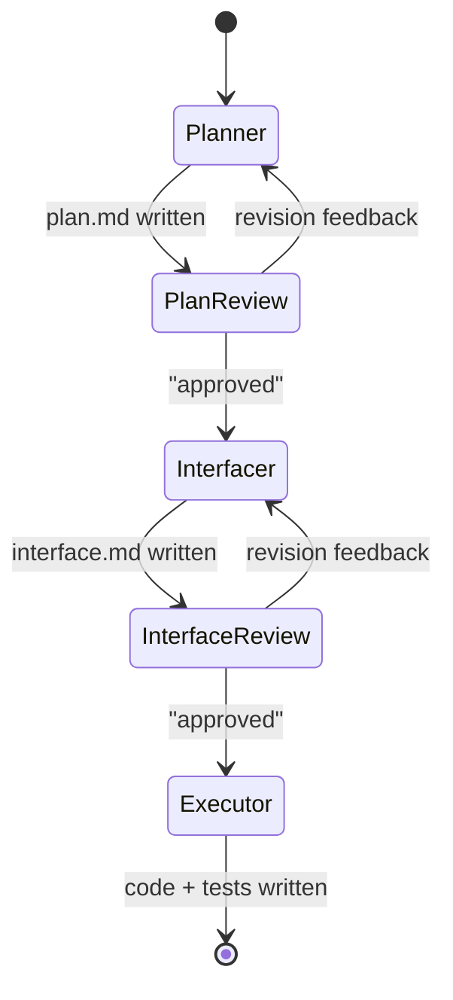
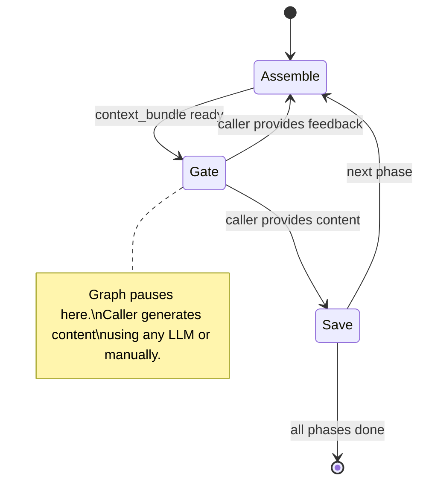
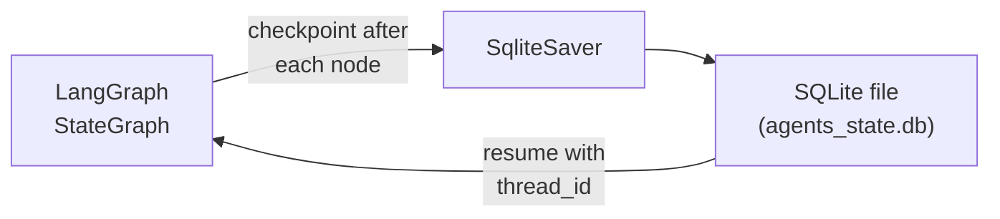

# Architecture

## Overview

**my-ai-tools** is a personal AI toolbox that exposes planning agents as
[MCP](https://modelcontextprotocol.io/) tools for Cursor (or any MCP client),
and as Python functions callable from scripts and CLIs.

The core problem it solves: *structured, iterative, multi-phase planning with
human-in-the-loop review, persisted across sessions, usable from any LLM
frontend.*

---

## System diagram



---

## Component breakdown

### 1. MCP Bridge (`mcp_bridge.py`)

**Role:** Entry point for Cursor and other MCP clients.

Wraps the planning flows as five MCP tools over stdio:

| Tool | Delegates to |
|---|---|
| `run_hello` | `hello_world.run_hello` |
| `plan_auto_start` | `plan_auto.start_auto_plan` |
| `plan_auto_resume` | `plan_auto.resume_auto_plan` |
| `plan_interactive_start` | `plan_interactive.start_interactive_plan` |
| `plan_interactive_resume` | `plan_interactive.resume_interactive_plan` |

Owns the global SQLite checkpointer (`agents_state.db`) and generates
`thread_id`s for new sessions.

**Rationale:** Keeps the MCP surface thin. All logic lives in the agents
package. Cursor talks to MCP; the agents don't know about MCP at all.

---

### 2. Planning flows (`my_ai_tools/agents/`)

This is the core of the system. There are two flows, distinguished by
**who drives the LLM calls** (control flow direction), not by which LLM
is used.

#### Auto flow (`plan_auto.py`)

```
Direction: Push — the graph calls the LLM internally.
Human role: Review and approve/revise between stages.
```



- **5 nodes**, 2 interrupt points (before each review node).
- Node functions are **closures** inside `build_graph(checkpointer, backend)`,
  capturing the backend module. This is how the LLM is pluggable without
  changing the graph structure.
- The human provides only feedback strings (`"approved"` or revision text).

#### Interactive flow (`plan_interactive.py`)

```
Direction: Pull — the graph returns context, the caller provides content.
Human role: Generate (or delegate to any LLM) + review at each stage.
```



- **3 nodes** in a tight cycle: assemble → gate → save.
- The graph **never calls an LLM**. Its entire external interface is:

```
  Agent ──context_bundle (str)──▶ [ANY caller] ──content (str)──▶ Agent
```

- Because the boundary is plain strings, the graph is **LLM-agnostic by
  construction**. Cursor, Ollama, Anthropic, or a human pasting text all
  work identically — the graph doesn't know or care what produced the content.
- Phases: `plan` → `interface` → `code` → `done`.

---

### 3. LLM backends (`plan_auto_*.py`)

Each backend module exports the same five functions:

| Function | Purpose |
|---|---|
| `generate_plan(task, root)` | First plan draft |
| `generate_plan_revision(task, root, existing, feedback)` | Revise plan |
| `generate_interface(plan, root)` | Interface/type signatures |
| `generate_interface_revision(plan, root, existing, feedback)` | Revise interface |
| `generate_code_and_tests(interface, root)` | Module + pytest stubs |

Current backends:

| Module | Transport | Model env var |
|---|---|---|
| `plan_auto_ollama.py` | Ollama Python SDK (local) | `OLLAMA_MODEL` (default: `llama3.2`) |
| `plan_auto_anthropic.py` | HTTP via `urllib.request` (no SDK) | `ANTHROPIC_MODEL` (default: `claude-sonnet-4-20250514`) |

The backend is selected at runtime via `_resolve_backend(name)` in
`plan_auto.py`, which does a `dict` lookup → `importlib.import_module`.

**Rationale:** Each backend manages its own model selection and
authentication internally. The auto flow graph doesn't know about models
or API keys — it just calls `backend.generate_plan(...)`.

---

### 4. Shared infrastructure (`planning_common.py`)

| Component | What it provides |
|---|---|
| `PlanningState` | TypedDict shared by the auto flow |
| File constants | `PLAN_FILE`, `INTERFACE_FILE`, `CODE_FILE`, `TEST_FILE` |
| `ensure_project_path()` | Resolve and validate the target project directory |
| `load_skill()` | Load `~/.cursor/skills/principal-ml-planning/SKILL.md` |
| `assemble_*_context()` | Build prompt bundles (used by interactive flow and CLI) |

**Rationale:** Both flows produce the same output files and use the same
planning framework (SKILL.md). Centralizing these avoids drift.

---

### 5. State persistence (LangGraph + SQLite)



- Each planning session gets a `thread_id` (UUID).
- LangGraph's `SqliteSaver` checkpoints the full state after every node
  execution.
- This enables: (a) interrupt/resume within a session, (b) cross-session
  persistence (close Cursor, reopen later, resume with the same thread_id).

**Rationale:** Human review is asynchronous and may span hours or days.
Without checkpointing, the entire graph state would be lost when the
process exits.

---

### 6. CLI and scripts

| File | Purpose |
|---|---|
| `scripts/plan_cli.py` | Terminal driver for the interactive flow. Supports `PLANNING_LLM=ollama\|anthropic\|none`. |
| `scripts/verify_agents.py` | Master verification: hello + interactive + auto. |
| `scripts/verify_plan_interactive.py` | Standalone interactive flow test (no LLM needed). |
| `scripts/verify_plan_auto.py` | Standalone auto flow test (requires Ollama). |
| `my_ai_tools/cli.py` | UV entry points: `check`, `tests`, `notebook`, `ollama-serve`, `mcp-bridge`. |

---

## Two orthogonal axes

The planning system's design separates two independent concerns:

```
                        LLM Backend
                 Ollama  Anthropic  Cursor  Manual
              ┌────────┬──────────┬───────┬───────┐
  Auto        │   ✓    │    ✓     │   ✗   │   ✗   │  graph calls LLM
  (push)      │        │          │       │       │
              ├────────┼──────────┼───────┼───────┤
  Interactive │   ✓    │    ✓     │   ✓   │   ✓   │  caller calls LLM
  (pull)      │        │          │       │       │
              └────────┴──────────┴───────┴───────┘
                                    Control Flow
```

- **Axis 1 — Control flow:** Who drives the loop? Auto (push) embeds LLM
  calls in the graph. Interactive (pull) externalizes them.
- **Axis 2 — LLM backend:** Who generates the text? Ollama, Anthropic,
  Cursor's built-in LLM, or a human.

These axes are orthogonal: adding a new backend to Auto requires only a
new `plan_auto_*.py` module (no graph changes). The Interactive flow
already works with any backend because it never calls one.

**Why Cursor can't be an Auto backend:** Cursor's LLM is the *caller* of
MCP tools, not something a tool can invoke. A tool can't recursively call
Cursor. The Interactive flow solves this by returning context to Cursor and
letting it generate.

---

## Key design decisions

### Why LangGraph?

- **Conditional edges** for the approve/revise loop without hand-rolled
  state machines.
- **Interrupt/resume** natively supported (`interrupt_before`).
- **Checkpointing** to SQLite with zero custom serialization.
- **Composability**: graphs can be nested or extended with new nodes.

### Why two flows instead of one?

A single graph can't serve both use cases well:

- Auto needs internal LLM calls and interrupt points for review.
- Interactive needs external content injection and a tight
  assemble→gate→save cycle.

Sharing `planning_common.py` keeps the overlap (state, files, context
assembly) in one place while letting each flow optimize its own topology.

### Why closures for the auto graph?

The backend module must be available inside node functions, but LangGraph
node functions are `(state) -> dict`. Options considered:

1. **Store backend name in state** — requires serialization of module refs
   or re-resolution on every node invocation.
2. **Global variable** — not thread-safe, can't run two backends
   concurrently.
3. **Closures inside `build_graph`** — clean, explicit, thread-safe.
   Each `build_graph(checkpointer, backend)` call creates fresh node
   functions that close over the backend module.

Option 3 was chosen for simplicity and correctness.

### Why `urllib.request` for Anthropic (not the SDK)?

- Zero additional dependency — `urllib` is stdlib.
- The Anthropic Messages API is a single HTTP POST with JSON.
- Keeps `pyproject.toml` dependencies minimal.
- Easy to swap for `httpx` or the official SDK later if needed.

### Why SKILL.md?

The `~/.cursor/skills/principal-ml-planning/SKILL.md` file contains a
domain-specific planning framework (principal ML engineer methodology).
Loading it into context ensures all LLM backends follow a consistent
planning structure. If the file is missing, the system degrades gracefully
(no error, just no framework in the prompt).

---

## Adding a new Auto backend

1. Create `my_ai_tools/agents/plan_auto_<name>.py` implementing:
   - `generate_plan(task_description: str, project_root: str) -> str`
   - `generate_plan_revision(task_description, project_root, existing_plan, feedback) -> str`
   - `generate_interface(plan_content, project_root) -> str`
   - `generate_interface_revision(plan_content, project_root, existing_interface, feedback) -> str`
   - `generate_code_and_tests(interface_content, project_root) -> tuple[str, str]`

2. Register in `plan_auto.py`:

```python
_BACKENDS["mybackend"] = "my_ai_tools.agents.plan_auto_mybackend"
```

3. Use: `plan_auto_start(task_description="...", backend="mybackend")`

No changes to the graph, MCP bridge, or interactive flow needed.

---

## Adding a new Interactive CLI backend

1. Add a `_generate_with_<name>(context: str) -> str` function in
   `scripts/plan_cli.py`.

2. Add the name to the `_generate()` router.

3. Use: `PLANNING_LLM=<name> uv run python scripts/plan_cli.py "task" /path`

No changes to `plan_interactive.py` — it's completely LLM-agnostic.

---

## File map

```
my-ai-tools/
├── mcp_bridge.py                     # MCP entry point (5 tools)
├── my_ai_tools/
│   ├── cli.py                        # UV commands (check, tests, etc.)
│   ├── ollama_client.py              # Ollama HTTP helper
│   └── agents/
│       ├── planning_common.py        # State, files, SKILL.md, context assembly
│       ├── plan_auto.py              # Auto graph + backend registry
│       ├── plan_auto_ollama.py       # Ollama backend (local)
│       ├── plan_auto_anthropic.py    # Anthropic backend (HTTP)
│       ├── plan_interactive.py       # Interactive graph (LLM-agnostic)
│       └── hello_world.py            # Test agent
├── scripts/
│   ├── plan_cli.py                   # Terminal CLI for interactive flow
│   ├── verify_agents.py              # Master verification
│   ├── verify_plan_interactive.py    # Interactive tests (no LLM)
│   └── verify_plan_auto.py           # Auto tests (requires Ollama)
├── docs/
│   ├── Architecture.md               # This file
│   └── Dev.md                        # Developer cookbook & examples
├── pyproject.toml
└── README.md                         # Quick-start & reference
```
