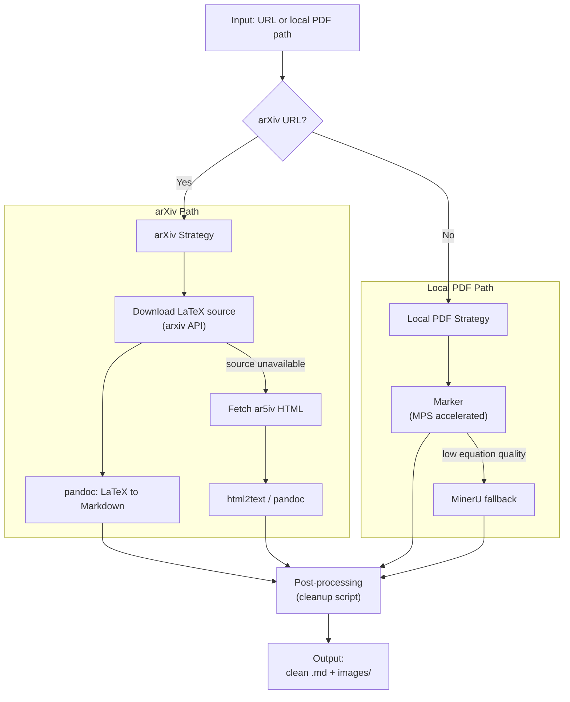

# PDF-to-Markdown Conversion Workflow

## Goal

Add a `pdf2md` CLI tool to the `my-ai-tools` project that converts ML/academic PDFs into clean markdown with correct LaTeX equations. Runs locally on Apple Silicon (MacBook Pro M4 / Mac Mini 2025) via MPS acceleration.

## Key Considerations

### 1. ArXiv papers have a shortcut -- don't parse the PDF

For arXiv papers, PDF parsing is the **worst** approach. Better options:

- **LaTeX source**: arXiv stores the original `.tex` source. Download and convert with `pandoc` -- gives perfect LaTeX equations by definition.
- **ar5iv HTML**: Every arXiv paper has an HTML version at `ar5iv.labs.arxiv.org/html/{paper_id}`. Converting HTML to markdown is trivial and preserves equations.

**Recommendation**: Use LaTeX source as primary strategy for arXiv, fall back to ar5iv HTML.

### 2. For local PDFs, use Marker or MinerU (both support Mac MPS)

- **Marker** -- simpler install (`pip install marker-pdf[full]`), fast on MPS, good equation support. Optional `--use-llm` flag improves accuracy but requires cloud API.
- **MinerU** -- dedicated local formula recognition model, excellent for equation-heavy papers. Heavier install (~2-3 GB models).

**Recommendation**: Start with Marker (simpler, faster). Add MinerU as a fallback for equation-heavy papers.

### 3. Equation handling is the hardest problem

- Inline math (`$...$`) vs display math (`$$...$$`) must be distinguished
- Marker without `--use-llm` may produce approximate equations; MinerU's local model is more reliable
- Post-processing needed: broken subscripts, misrecognized symbols, split equations

### 4. Local-first constraint

- **No cloud API dependencies in the default path** -- Marker's `--use-llm` is opt-in only
- **MPS acceleration** -- both tools run on Apple's Metal Performance Shaders
- **Model downloads** -- Marker ~1 GB, MinerU ~2-3 GB; cached locally after first run
- **Memory** -- Marker ~2-3 GB, MinerU ~4-6 GB; comfortable on M4

### 5. LLM-enhanced mode: vendors, API keys, and configuration

Both Marker and MinerU can optionally use an LLM to improve accuracy on complex elements (merged tables, inline math, forms). This is **opt-in** -- the default path uses no LLM and no API keys.

#### Three LLM options (from most local to most cloud)

**Option A: Ollama (fully local, no API key)**
- Uses Ollama already running in `my-ai-tools` (`uv run ollama-serve`)
- Marker config: `--llm_service marker.services.ollama.OllamaService --ollama_model gemma3:27b`
- Best fit for local-first goal; requires ~16 GB RAM for 27B model (or use `gemma3:4b` for lighter)
- Known issue: Marker + Ollama has reported JSON schema compatibility bugs; may need workaround

**Option B: Google Gemini (cloud, Marker backend)**
- Marker's default LLM: `gemini-2.0-flash`
- Free tier: 15 RPM / 1M tokens per day -- sufficient for occasional paper conversion
- Setup:
  1. Get a free API key at https://aistudio.google.com/apikey
  2. Set environment variable: `export GOOGLE_API_KEY="your_key_here"`
  3. Run: `uv run pdf2md convert paper.pdf --use-llm gemini`

**Option C: OpenAI (cloud, MinerU backend)**
- Uses GPT-4o-mini or GPT-4o for enhanced table/equation recognition
- Setup:
  1. Get API key at https://platform.openai.com/api-keys
  2. Set environment variable: `export OPENAI_API_KEY="your_key_here"`
  3. Run: `uv run pdf2md convert paper.pdf --backend mineru --use-llm openai`
- MinerU config (`~/.mineru/magic-pdf.json`), auto-generated by the CLI:
  ```json
  {
    "llm-aided-config": {
      "api_key": "<read from OPENAI_API_KEY>",
      "base_url": "https://api.openai.com/v1",
      "model": "gpt-4o-mini",
      "enable": true
    }
  }
  ```

**Option D: Anthropic Claude (cloud, MinerU backend via OpenAI-compatible proxy)**
- Claude does not natively expose an OpenAI-compatible endpoint, so this requires a proxy or adapter
- Easiest path: use LiteLLM as a local proxy (`pip install litellm`)
  1. Set: `export ANTHROPIC_API_KEY="your_key_here"`
  2. Start proxy: `litellm --model anthropic/claude-sonnet-4-20250514 --port 8000`
  3. Configure MinerU to point at the proxy:
     ```json
     {
       "llm-aided-config": {
         "api_key": "sk-placeholder",
         "base_url": "http://localhost:8000/v1",
         "model": "anthropic/claude-sonnet-4-20250514",
         "enable": true
       }
     }
     ```
- Alternative: use any OpenAI-compatible gateway (e.g., OpenRouter, AWS Bedrock with gateway)

**Option E: Any other OpenAI-compatible provider (cloud, MinerU backend)**
- MinerU works with any provider that speaks the OpenAI `/v1/chat/completions` protocol
- Examples:
  - **OpenRouter**: `base_url: "https://openrouter.ai/api/v1"`, key from https://openrouter.ai/keys
  - **Azure OpenAI**: `base_url: "https://{resource}.openai.azure.com/openai/deployments/{deployment}/"`
  - **Together AI**: `base_url: "https://api.together.xyz/v1"`, key from https://api.together.xyz
  - **Groq**: `base_url: "https://api.groq.com/openai/v1"`, key from https://console.groq.com
- Setup pattern is always the same:
  1. Set: `export LLM_API_KEY="your_key_here"`
  2. Run: `uv run pdf2md convert paper.pdf --backend mineru --use-llm openai --llm-base-url "https://..." --llm-model "model-name"`

#### How the CLI exposes this

```bash
# Default: no LLM, no API key needed
uv run pdf2md convert paper.pdf

# --- Local LLM ---

# Ollama (fully local, no API key, requires ollama running)
uv run pdf2md convert paper.pdf --use-llm ollama
uv run pdf2md convert paper.pdf --use-llm ollama --llm-model gemma3:4b

# --- Cloud LLMs ---

# Google Gemini (requires GOOGLE_API_KEY env var)
uv run pdf2md convert paper.pdf --use-llm gemini

# OpenAI via MinerU (requires OPENAI_API_KEY env var)
uv run pdf2md convert paper.pdf --backend mineru --use-llm openai

# OpenAI with a specific model
uv run pdf2md convert paper.pdf --backend mineru --use-llm openai --llm-model gpt-4o

# Any OpenAI-compatible provider via MinerU
uv run pdf2md convert paper.pdf --backend mineru --use-llm openai \
  --llm-base-url "https://openrouter.ai/api/v1" \
  --llm-model "anthropic/claude-sonnet-4-20250514"
```

#### API key management

| Provider | Env Variable | How to get it |
|---|---|---|
| Ollama | (none needed) | Already running locally |
| Google Gemini | `GOOGLE_API_KEY` | https://aistudio.google.com/apikey |
| OpenAI | `OPENAI_API_KEY` | https://platform.openai.com/api-keys |
| OpenRouter | `LLM_API_KEY` | https://openrouter.ai/keys |
| Together AI | `LLM_API_KEY` | https://api.together.xyz |
| Groq | `LLM_API_KEY` | https://console.groq.com |
| Custom | `LLM_API_KEY` | (your provider) |

Key lookup order:
1. CLI flag `--llm-api-key` (not recommended, visible in shell history)
2. Provider-specific env var (`GOOGLE_API_KEY`, `OPENAI_API_KEY`)
3. Generic env var (`LLM_API_KEY`) -- fallback for any provider
4. Config file (`~/.pdf2md.toml`)

**Config file** (`~/.pdf2md.toml`) -- optional convenience for defaults:
```toml
[llm]
provider = "ollama"            # default: "ollama" | "gemini" | "openai"
model = "gemma3:27b"           # default model for chosen provider

[llm.openai]                   # only needed for OpenAI-compatible providers
base_url = "https://api.openai.com/v1"
# api_key = "..."              # prefer env var over storing key here
```

The CLI validates keys at runtime and prints a clear error if missing:
```
Error: --use-llm gemini requires GOOGLE_API_KEY environment variable.
Get a free key at: https://aistudio.google.com/apikey
```

### 6. Post-processing cleanup

Common issues needing scripted cleanup:
- Headers/footers/page numbers bleeding into text
- Broken hyphenation from line breaks
- Duplicate whitespace and blank lines
- Unicode normalization (ligatures like "ff", "fi")

---

## Architecture



## Integration into my-ai-tools

### File layout

New files to create:

```
my_ai_tools/
  pdf2md/
    __init__.py
    cli.py            # typer CLI (entry point for `uv run pdf2md`)
    converter.py      # dispatch logic: arXiv URL vs local PDF
    backends/
      __init__.py
      marker.py       # Marker wrapper (Phase 1)
      arxiv.py        # arXiv LaTeX/HTML fetching (Phase 2)
      mineru.py       # MinerU wrapper (Phase 3)
    postprocess.py    # cleanup functions
```

### pyproject.toml changes

```toml
# Add optional dependency group
[project.optional-dependencies]
pdf2md = [
    "marker-pdf[full]",
    "typer",
    "requests",
    "beautifulsoup4",
]

# Add CLI entry point
[project.scripts]
pdf2md = "my_ai_tools.pdf2md.cli:app"
```

System dependency: `brew install pandoc` (for arXiv LaTeX conversion)

### CLI interface

```bash
# Convert a local PDF (default: Marker backend, no LLM, no API key)
uv run pdf2md convert ./paper.pdf

# Convert an arXiv paper (auto-detects, uses LaTeX source)
uv run pdf2md convert https://arxiv.org/abs/2301.12345

# Specify output directory
uv run pdf2md convert ./paper.pdf --output ./notes/

# LLM-enhanced with Ollama (fully local, no API key)
uv run pdf2md convert ./paper.pdf --use-llm ollama

# LLM-enhanced with Gemini (requires GOOGLE_API_KEY env var)
uv run pdf2md convert ./paper.pdf --use-llm gemini

# Use MinerU backend instead (Phase 3)
uv run pdf2md convert ./paper.pdf --backend mineru

# Batch convert a folder
uv run pdf2md convert ./papers/ --output ./markdown/
```

---

## Implementation Plan

### Phase 1: Core CLI with Marker backend

1. Add `pdf2md` optional dependency group to `pyproject.toml`
2. Create `my_ai_tools/pdf2md/` package structure
3. Implement `backends/marker.py` -- wraps Marker's Python API for single-file PDF-to-markdown
4. Implement `postprocess.py` -- whitespace cleanup, header/footer removal, unicode normalization
5. Implement `cli.py` -- typer app with `convert` command
6. Wire up `pdf2md` script entry point in `pyproject.toml`
7. Test on a local ML paper PDF

### Phase 2: ArXiv integration

1. Implement `backends/arxiv.py`:
   - Parse arXiv URLs/IDs (support `arxiv.org/abs/`, `arxiv.org/pdf/`, bare IDs like `2301.12345`)
   - Download LaTeX source tarball via arXiv API, extract `.tex` file
   - Convert with `pandoc --from=latex --to=markdown`
   - Fallback: fetch ar5iv HTML, convert with `pandoc --from=html --to=markdown`
2. Update `converter.py` to auto-detect arXiv URLs and route accordingly
3. Test on several arXiv ML papers

### Phase 3: LLM enhancement + MinerU fallback

1. Add `--use-llm` flag with provider selection (`ollama` | `gemini`)
   - Ollama path: configure `marker.services.ollama.OllamaService`, reuse existing Ollama setup
   - Gemini path: read `GOOGLE_API_KEY` from env, validate at startup, clear error if missing
2. Add `magic-pdf` to optional dependencies (separate group `pdf2md-mineru`)
3. Implement `backends/mineru.py` -- wraps MinerU's Python API
4. Add `--backend` flag to CLI (`marker` | `mineru`)
5. Add optional config file support (`~/.pdf2md.toml`) for LLM defaults
6. Test equation quality: compare no-LLM vs Ollama vs Gemini on equation-heavy papers

### Phase 4: Polish

1. Batch processing: detect directory input, convert all PDFs
2. Obsidian-friendly output: relative image paths, YAML frontmatter with paper metadata (title, authors, date)
3. Config file support (~/.pdf2md.toml) for defaults
